# MyHanaApp - A sample SAP CAP application

https://developers.sap.com/group.hana-cloud-cap-setup.html

https://learning.sap.com/learning-journeys/installing-and-administering-sap-hana/illustrating-deployment-options

https://community.sap.com/t5/technology-blog-posts-by-sap/sap-cloud-platform-backend-service-overview-of-blogs/ba-p/13390923

## GIT - Add Repository- Creating a new repository

To create a new Git repository, run the following commands:

git init

git add .

git commit -m "Initial App changes Commit"

git branch -M master/main

git remote add origin  https://

git push -f origin master/main

# Create database entities

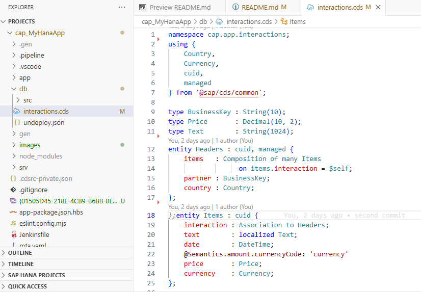

# # Understanding the Difference between association and composition in cds 

In CDS, associations are defined using the `Association` keyword, while compositions are defined using the `Composition` keyword. This syntactical difference highlights their functional distinctions in terms of ownership and lifecycle management.

## Key Differences
- Associations allow entities to reference each other without ownership, while compositions imply ownership and lifecycle dependency.\n- In associations, child entities can exist independently of the parent, whereas in compositions, child entities are deleted if the parent is deleted.\n- Associations are defined with the `Association` keyword and compositions with the `Composition` keyword in CDS.

In CDS, associations are used for loosely coupled relationships, while compositions are used for tightly coupled relationships where ownership and lifecycle are important.

Understanding these differences helps in structuring your data models effectively, ensuring data integrity and appropriate handling of related entities.

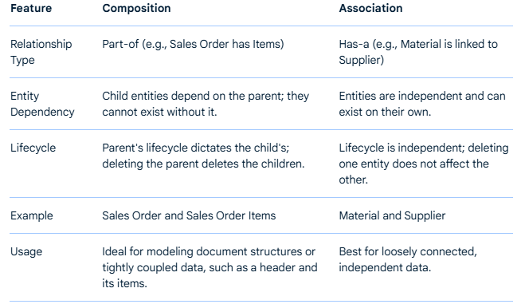

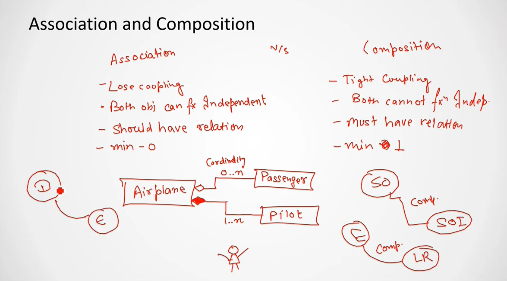

*************************************************************************************
# # managed and unmanaged associations in sap capm

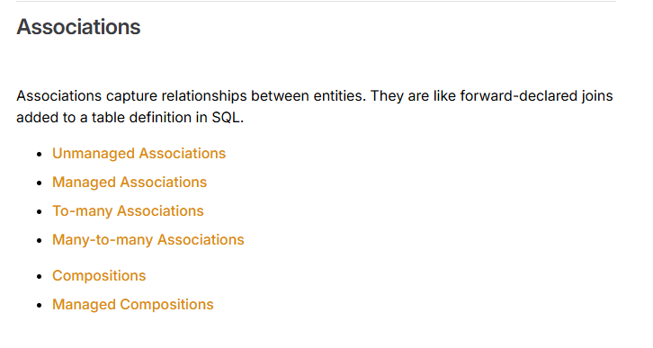

https://community.sap.com/t5/technology-blog-posts-by-sap/sap-cloud-platform-backend-service-tutorial-4-cds-how-to-define/ba-p/13393353

Unmanaged Associations
Unmanaged associations specify arbitrary join conditions in their on clause, which refer to available foreign key elements. The association's name (address in the following example) is used as the alias for the to-be-joined target entity.

entity Employees {

  address : Association to Addresses on address.ID = address_ID;

  address_ID : Integer;  //> foreign key

}

entity Addresses {

  key ID : Integer;

}
Managed (To-One) Associations
For to-one associations, CDS can automatically resolve and add requisite foreign key elements from the target's primary keys and implicitly add respective join conditions.

entity Employees {

  address : Association to Addresses;

}
This example is equivalent to the unmanaged example above, with the foreign key element address_ID being added automatically upon activation to a SQL database. The names of the automatically added foreign key elements cannot be changed.

Note: For adding foreign key constraints on database level, see Database Constraints..

If the target has a single primary key, a default value can be provided. This default applies to the generated foreign key element address_ID:

entity Employees {

  address : Association to Addresses default 17;

}
To-many Associations
For to-many associations specify an on condition following the canonical expression pattern <assoc>.<backlink> = $self as in this example:

entity Employees {

  key ID : Integer;

  addresses : Association to many Addresses

    on addresses.owner = $self;

}

entity Addresses {

  owner : Association to Employees;  //> the backlink

}
The backlink can be any managed to-one association on the many side pointing back to the one side.

Many-to-many Associations

For many-to-many association, follow the common practice of resolving logical many-to-many relationships into two one-to-many associations using a link entity to connect both. For example:

entity Employees { [...]

  addresses : Association to many Emp2Addr on addresses.emp = $self;

}
entity Emp2Addr {

  key emp : Association to Employees;

  key adr : Association to Addresses;

}
Learn more about Managed Compositions for Many-to-many Relationships.

Compositions
Compositions constitute document structures through contained-in relationships. They frequently show up in to-many header-child scenarios.

entity Orders {

  key ID: Integer; //...

  Items : Composition of many Orders.Items on Items.parent = $self;

}
entity Orders.Items {

  key pos : Integer;

  key parent : Association to Orders;

  product : Association to Products;

  quantity : Integer;

}
Contained-in relationship

Essentially, Compositions are the same as associations, just with the additional information that this association represents a contained-in relationship so the same syntax and rules apply in their base form.

Limitations of Compositions of one

Using compositions of one for entities is discouraged. There is often no added value of using them as the information can be placed in the root entity. Compositions of one have limitations as follow:

Very limited Draft support. Fiori elements does not support compositions of one unless you take care of their creation in a custom handler.
No extensive support for modifications over paths if compositions of one are involved. You must fill in foreign keys manually in a custom handler.

Managed Compositions of Aspects
Use managed compositions variant to nicely reflect document structures in your domain models, without the need for separate entities, reverse associations, and unmanaged on conditions.

With Inline Targets

entity Orders {
  key ID: Integer; //...
  Items : Composition of many {
    key pos : Integer;
    product : Association to Products;
    quantity : Integer;
  }
};
Managed Compositions are mostly syntactical sugar: Behind the scenes, they are unfolded to the unmanaged equivalent as shown above by automatically adding a new entity, the name of which being constructed as a scoped name from the name of parent entity, followed by the name of the composition element, that is Orders.Items in the previous example. You can safely use this name at other places, for example to define an association to the generated child entity:

entity Orders {
  // …
  specialItem : Association to Orders.Items;
};
With Named Targets
Instead of anonymous target aspects you can also specify named aspects, which are unfolded the same way as anonymous inner types, as shown in the previous example:

entity Orders {
  key ID: Integer; //...
  Items : Composition of many OrderItems;
}
aspect OrderItems {
  key pos : Integer;
  product : Association to Products;
  quantity : Integer;
}
Default Target Cardinality
If not otherwise specified, a managed composition of an aspect has the default target cardinality to-one.

For Many-to-many Relationships
Managed Compositions are handy for many-to-many relationships, where a link table usually is private to one side.

entity Teams { [...]
  members : Composition of many { key user: Association to Users; }
}
entity Users { [...]
  teams: Association to many Teams.members on teams.user = $self;
}
And here's an example of an attributed many-to-many relationship:

entity Teams { [...]
  members : Composition of many {
    key user : Association to Users;
    role : String enum { Lead; Member; Collaborator; }
  }
}
entity Users { ... }
To navigate between Teams and Users, you have to follow two associations: members.user or teams.up_. In OData, to get all users of all teams, use a query like the following:

GET /Teams?$expand=members($expand=user)

Managed and unmanaged associations in SAP CAPM differ in how they handle foreign keys: managed associations automatically create and manage foreign key fields, while unmanaged associations require you to explicitly define the join condition using an on clause. A managed association is simpler as it handles the foreign key and join logic for you, whereas an unmanaged one provides more control for complex relationships or when you want to avoid the automatic creation of foreign key fields. 
Managed Association
What it is: The CAPM framework automatically creates the necessary foreign key fields and join conditions behind the scenes based on the primary keys of the associated entities.
When to use: Use for simple, straightforward relationships where the standard foreign key setup is sufficient.

Example:
cds
namespace my.bookshop;

entity Books {
  key ID : Integer;

  title  : String;

  author : Association to Authors; // Managed association

}

entity Authors {
  key ID : Integer;

  name   : String;

  books  : Association to many Books;

}

Behind the scenes: CAP adds an author_ID field to the Books table and automatically creates the JOIN condition in queries. 

Unmanaged Association

What it is: You must explicitly define the join condition using an on clause, referencing existing elements in the entities.
When to use: Use when you need more control over the join logic, for complex relationships, or when you don't want the framework to automatically generate a foreign key field.
Example:

cds
namespace my.bookshop;

entity Books {
  key ID : Integer;

  title  : String;
  // Unmanaged association to authors, based on a specific field

  author : Association to Authors on author.ID = book_author_ID;

  book_author_ID : String; // Foreign key is explicitly declared
}

entity Authors {
  key ID : String; // Note the ID type is now String to match the unmanaged association's join key
  
  name   : String;

}

Behind the scenes: The on condition author.ID = book_author_ID specifies the exact join logic, and the book_author_ID field is used instead of an automatically generated one. 

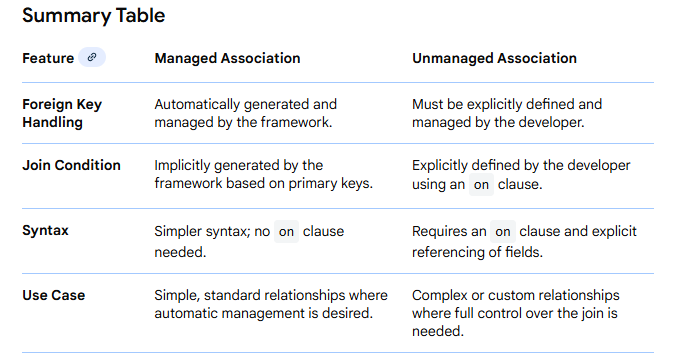

## Deploy db CDS to hana cloud

To deploy your CDS model to SAP HANA Cloud, follow these steps:
1. Ensure you have the SAP HANA Cloud CLI installed and configured.
2. Navigate to your project directory in the terminal.
3. Run the command `cds deploy --to hana` to deploy your CDS model.
4. Monitor the deployment process for any errors.
5. Once deployment is successful, verify your model in the SAP HANA Cloud cockpit.

6. Test your deployed CDS model by querying the entities using the SAP HANA Cloud database tools or through your application.

1) cds build

 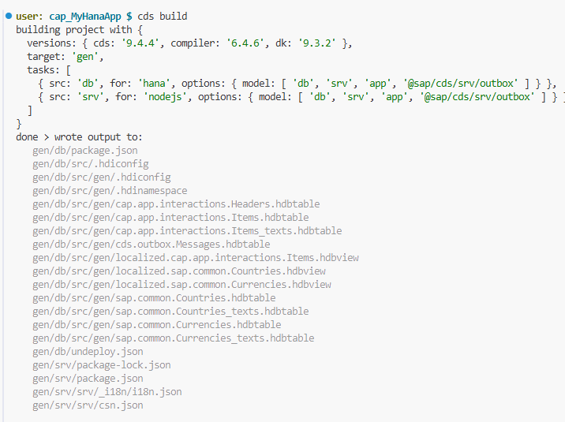
 

2) cds deploy 

   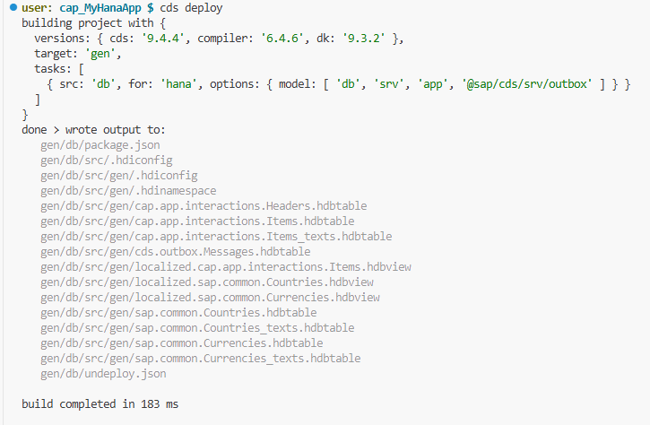

   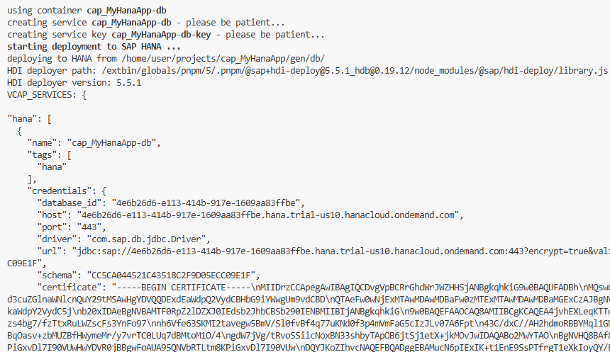

   

   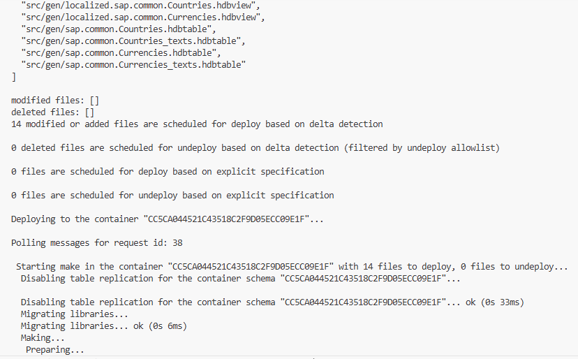

   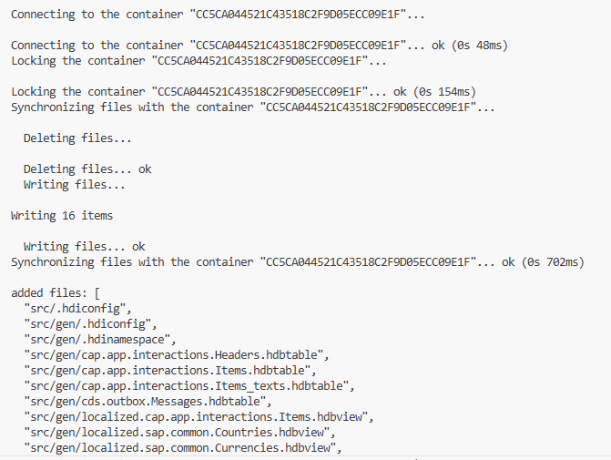

   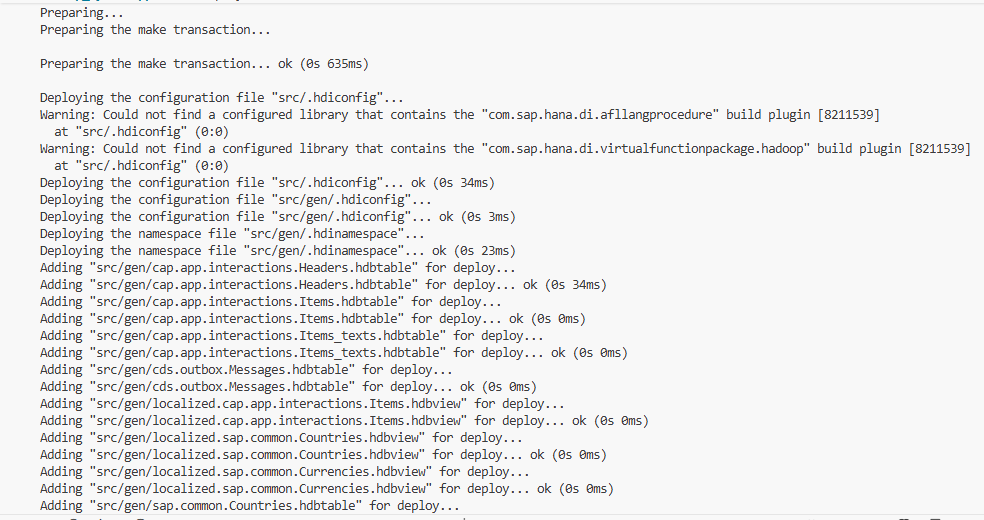

   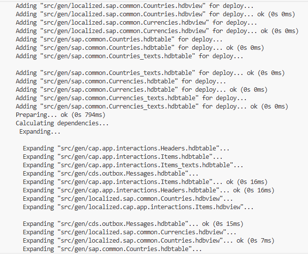

   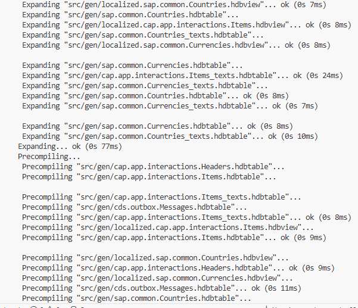

   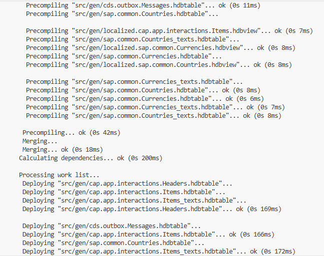

   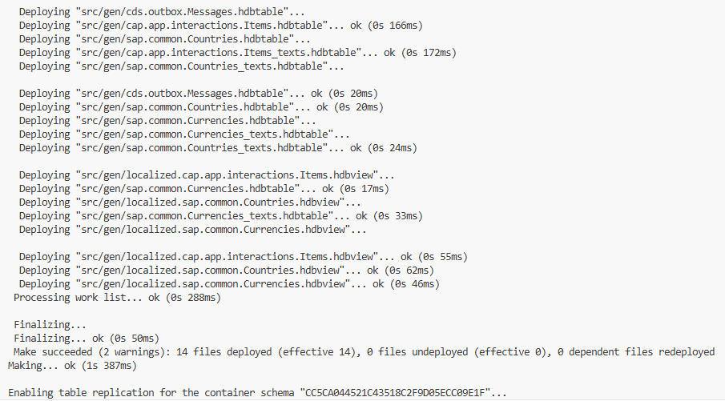

   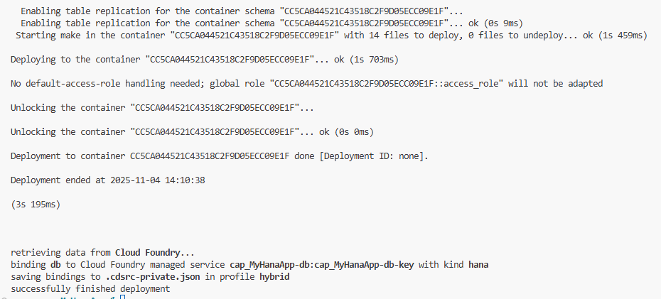

   
## Validate  CDS Tables in HANA Cloud

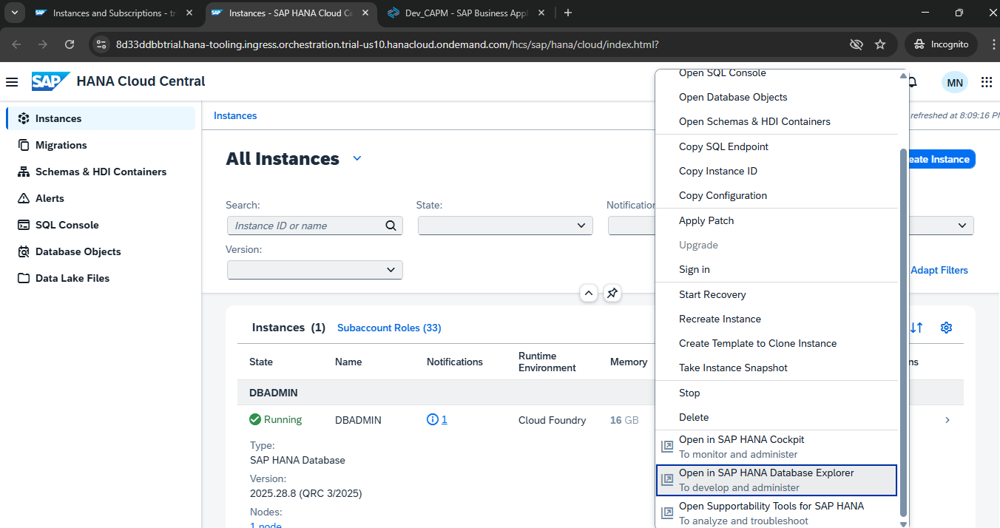

   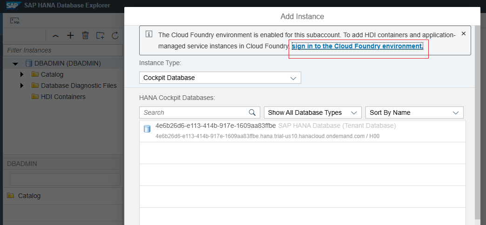

   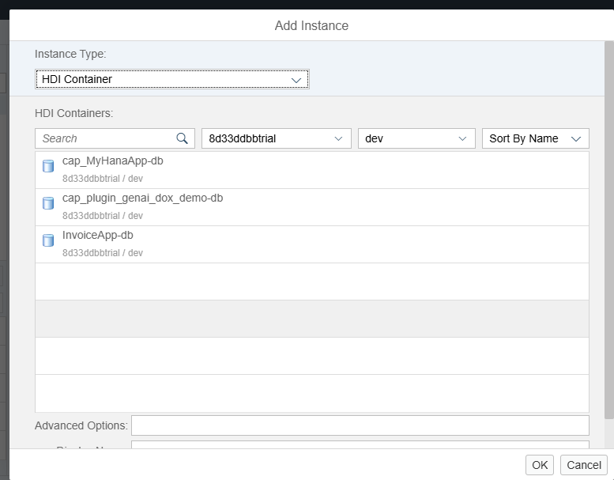

   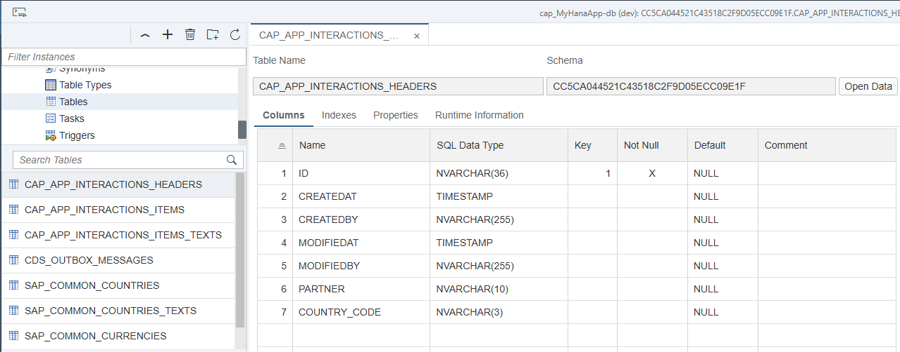

   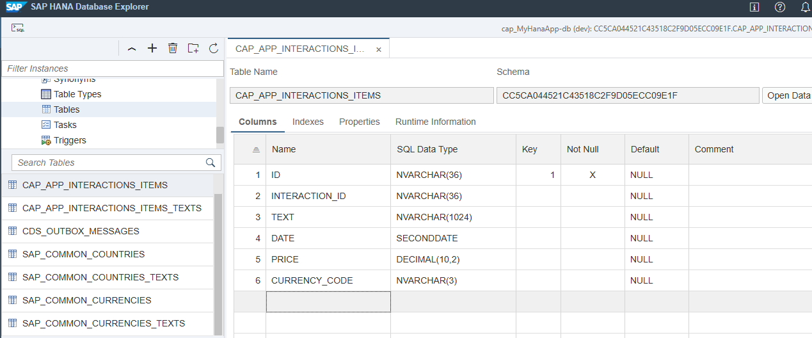

   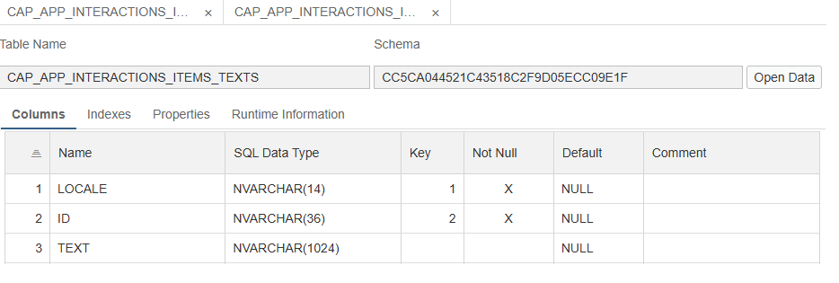

   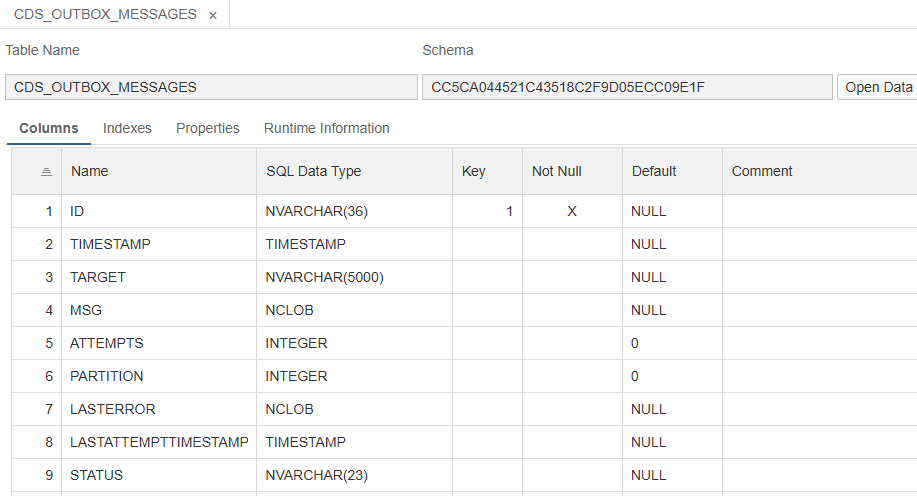

   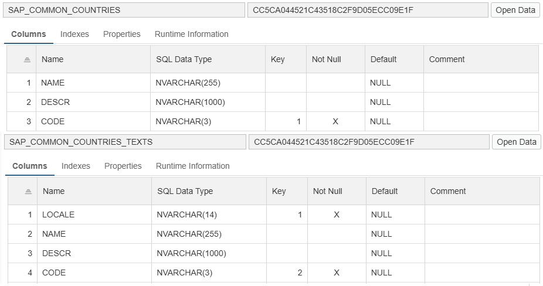

   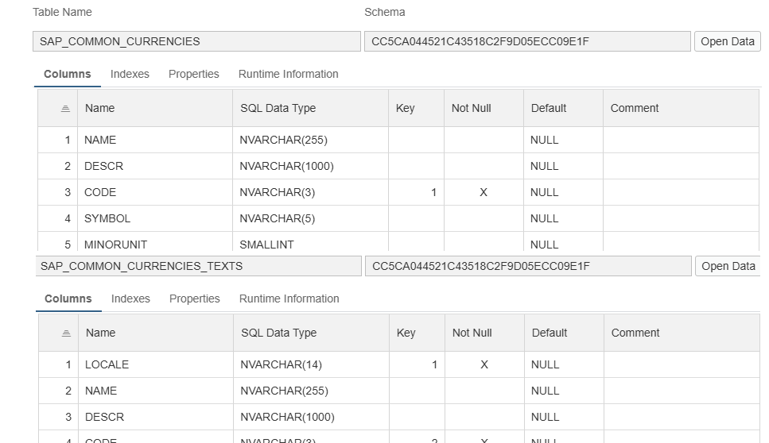

   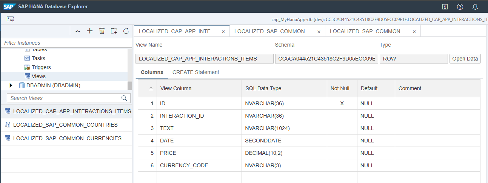

   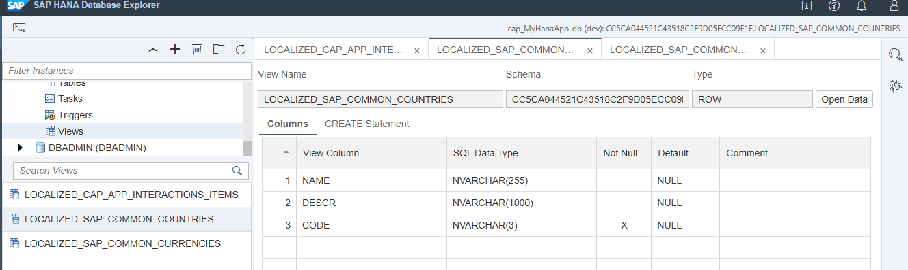

   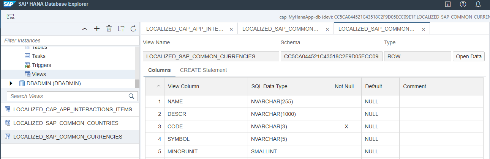

    

# # diff between binding of HDI Container vs deploy cds to hana in sap capm

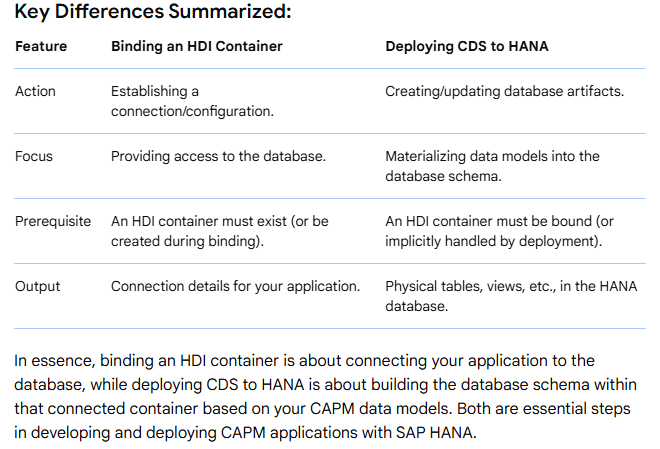

# # Create service interface

In the srv (**not src!**) folder create another file and name it interaction_srv.cds

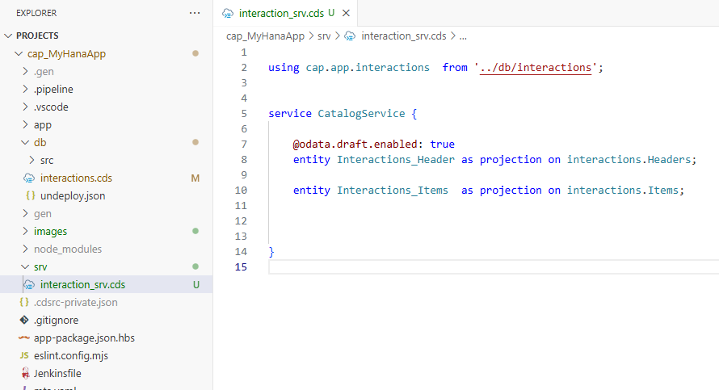

# # Check data loaded into the tables

# App Router Modules

Ensure the App Router is configured to connect to the HANA database and the necessary routes are defined for accessing the CDS services.
In the `app/router` folder, create a new file named `routes.js` and define the routes for your services. Make sure to include the necessary authentication and authorization middleware to secure your endpoints.

https://www.npmjs.com/package/@sap/approuter

To install the SAP Cloud Application Programming Model (CAP) and set up your project, follow the instructions in the official documentation. Make sure to include the necessary packages such as `@sap/cds`, `@sap/approuter`, and any other dependencies required for your application.

# # 
Among other information, this configuration is declaring that requests containing the pattern ^/(.*)$ are routed to a destination called srv-api. This destination was defined by the wizard in the mta.yaml file and points the service layer of our CAP application.

# Create a Fiori web interface

We want to create a Fiori UI for our CAP service. We will use the wizards to generate most of the UI.

From the top menu select View -> Command Pallette. Then type fiori into the search box. Select Fiori Open Application Generator.

##

using CatalogService as service from '../../srv/interaction_srv';

annotate service.Interactions_Header with @(

    UI.FieldGroup #GeneratedGroup : {

        $Type : 'UI.FieldGroupType',

        Data : [
            {
                $Type : 'UI.DataField',
                Label : 'partner',
                Value : partner,
            },
            {
                $Type : 'UI.DataField',
                Label : 'country_code',
                Value : country_code,
            },
        ],

    },

    UI.Facets : [

        {

            $Type : 'UI.ReferenceFacet',
            ID : 'GeneratedFacet1',
            Label : 'General Information',
            Target : '@UI.FieldGroup#GeneratedGroup',

        },

    ],

    UI.LineItem : [

        {
            $Type : 'UI.DataField',
            Label : 'partner',
            Value : partner,

        },
        {

            $Type : 'UI.DataField',
            Label : 'country_code',
            Value : country_code,

        },

    ],
    
);

   

